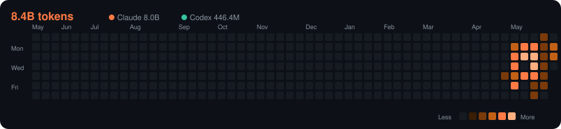

# Hi, 我是 Chia-Che 👋

軟體工程師 · 打造好用的產品與工具。
🌐 個人網站:https://chiache726.github.io

<!-- 下面這塊「使用量卡片」是自動產生的,請勿手動編輯標記之間的內容。 -->
<!-- 上下這些文字你可以自由修改。 -->

<!-- CLAUDE-USAGE:START -->

### 🤖 My AI Usage

  

**各模型**

| 模型 | 來源 | Tokens | 訊息 | 估算 API 等值 |
|------|------|-------:|------:|------:|
| `claude-opus-4-7` | Claude | 7.0B | 26,562 | $16,878 |
| `claude-opus-4-8` | Claude | 664.8M | 3,367 | $1,697 |
| `gpt-5.5` | OpenAI Codex | 446.4M | 3,870 | $88 |
| `claude-haiku-4-5-20251001` | Claude | 314.9M | 3,701 | $51 |
| `claude-sonnet-4-6` | Claude | 25.2M | 776 | $18 |

**各裝置**

| 裝置 | Tokens | 估算 API 等值 |
|------|-------:|------:|
| `tw300046454` | 4.3B | $9,549 |
| `Office-4090` | 4.1B | $9,183 |

📊 由本機各 AI CLI 用量自動產生 · 熱力圖為每日 token 量 · 成本為 <b>API 等值估算</b>(訂閱制非按 token 計費)· 最後更新 2026-06-02 13:55 UTC

<!-- CLAUDE-USAGE:END -->

---

這個頁面的使用量由 [`tools/claude-usage-profile`](./tools/claude-usage-profile) 自動更新。
